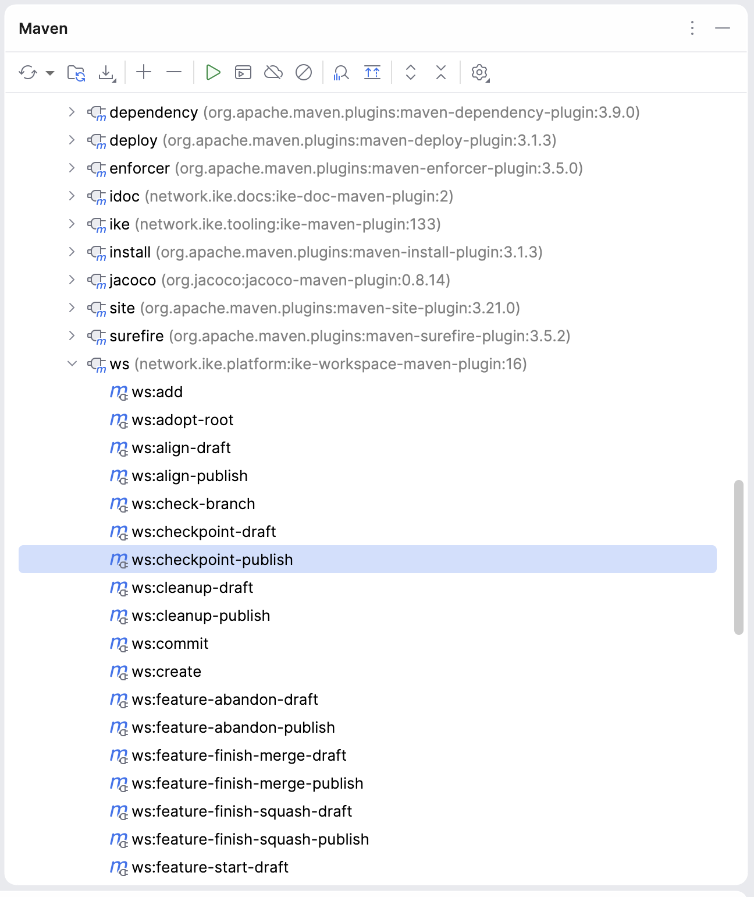
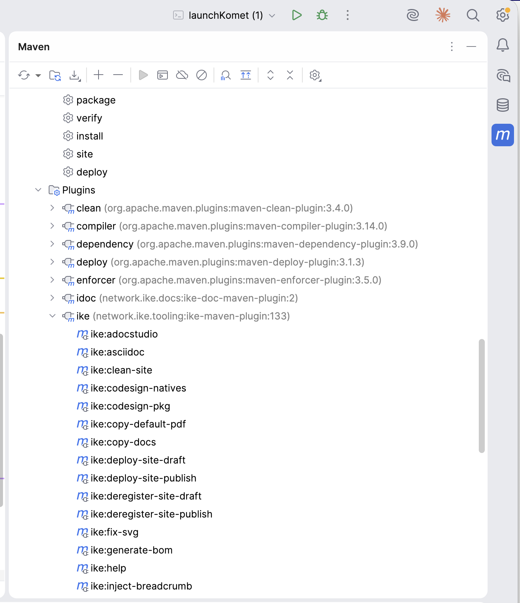

# IKE Maven Plugin

The `ike-maven-plugin` provides the `ike:*` goal prefix — 34 goals covering single-repo release orchestration, site deploy + publishing, scaffolding, version upgrades, the AsciiDoc rendering pipeline, native packaging utilities, and BOM generation.

| Coordinate | Value |
| --- | --- |
| Group ID | `network.ike.tooling` |
| Artifact ID | `ike-maven-plugin` |
| Goal prefix | `ike:` |
| Packaging | `maven-plugin` |
| Java version | 25 |

For workspace-spanning goals (`ws:*` prefix), see the [ws plugin](https://ike.network/ike-platform/ike-workspace-maven-plugin/)[1] in `ike-platform`. The two plugins are deliberately separate — `ike:*` is single-repo, `ws:*` fans out across a workspace’s checked-out subprojects.

## [#plugin-shape](#plugin-shape)Plugin shape

This is a **regular Maven plugin** — no `<extensions>true</extensions>`, no custom `<packaging>` type registered via `META-INF/plexus/components.xml`, no participation in the build extension realm. Goals look up at execution time, the plugin’s `<version>` interpolates from `${ike-tooling.version}` like any other managed plugin, and consumers inherit the version through ordinary `<pluginManagement>` indirection.

This was not always the case. Earlier revisions registered the `<packaging>ike-doc</packaging>` custom type here (the stale `components.xml` removed per `IKE-Network/ike-issues#320`), which forced this plugin to be loaded as a build extension and consequently forced its `<version>` to be a literal string everywhere it was declared. That constraint was retired alongside the migration to a classifier-canonical doc shape — see the [ike-tooling reactor home](#https-ike-network-ike-tooling) for the full design rationale, or `IKE-Network/ike-issues#321` for the umbrella tracking issue.

What this means for plugin consumers: nothing changes about how you **invoke** `ike:*` goals. What changed is that the plugin no longer forces literal-version pins in your POM, and no longer contributes `<packaging>ike-doc</packaging>` to your reactor. Doc modules use `<packaging>pom</packaging>` (or `<packaging>jar</packaging>` for hybrids) plus an `adoc` classifier attachment; the activation is path-conditional on `src/docs/asciidoc/` existence in `ike-parent’s `doc-pipeline` profile.

## [#goal-naming-convention](#goal-naming-convention)Goal naming convention

Most state-mutating goals come in a draft / publish pair:

```
mvn ike:release-draft        # report what would happen, write nothing
mvn ike:release-publish      # apply the changes
```

The bare goal name (e.g. `ike:release`) is wired to the draft variant. This is the same convention used by `ws:*` — every mutation is two-phase with a real chance to audit the draft before committing.

Read-only goals (e.g. `ike:help`, `ike:scan-logs`) have no draft/publish split — they are always safe.

## [#quick-start--intellij-idea](#quick-start--intellij-idea)Quick start — IntelliJ IDEA

Open the project in IntelliJ. The Maven tool window (right sidebar, **View → Tool Windows → Maven** if hidden) auto-discovers the `ike:*` goals from this plugin’s `<pluginManagement>` declaration in `ike-parent`. Both `ike` and `ws` (the workspace plugin) appear as top-level entries:

 

Expand the `ike (network.ike.tooling:ike-maven-plugin:…​)` entry to see all 34 goals:

 

Common interactions:

- **Run a read-only goal** (`ike:help`, `ike:scan-logs`) — **double-click** the goal in the tree.
- **Run a goal with parameters** (e.g. `ike:deploy-site-publish` needs `-DsiteType=`…​) — **right-click** the goal → **Modify Run Configuration…** → fill `Properties` (e.g. `siteType=release,siteVersion=21`) → **Run**.
- **Pin frequently-used invocations** — once a Run Configuration is saved, it appears in the toolbar dropdown for one-click access.
- **Discover goals** — `ike:help` prints the registry, but the Maven tool window has all goals visible by name without running anything.

For workspace-spanning operations, the same IntelliJ pattern applies to the `ws:*` plugin in `ike-platform` — see the [ws plugin Quick Start](https://ike.network/ike-platform/ike-workspace-maven-plugin/)[1].

## [#quick-start--command-line](#quick-start--command-line)Quick start — Command line

```
# Diagnose any in-flight or partial release (read-only)
mvn ike:release-status

# Preview a release (writes a markdown report; no on-disk changes)
mvn ike:release-draft

# Execute a release: tag, deploy to Nexus + komet.sh + gh-pages,
# bump to next SNAPSHOT
mvn ike:release-publish

# Re-deploy the site for the current release without re-releasing
mvn ike:deploy-site-publish -DsiteType=release

# Apply scaffold convention upgrades
mvn ike:scaffold-publish

# Apply build-tool version upgrades
mvn ike:versions-upgrade-publish
```

## [#quick-reference](#quick-reference)Quick reference

| Goal | Phase | Purpose |
| --- | --- | --- |
| [release-{draft,publish}](#release-draft) | release | Single-repo release: tag, deploy to Nexus + komet.sh + GitHub Pages, bump |
| [verify-release-published](#verify-release-published) | release | Verify all post-release publication targets (6 read-only HTTP checks) |
| [deploy-site-{draft,publish}](#deploy-site) | site | Generate and deploy the Maven site (release / snapshot / checkpoint variants) |
| [register-site-{draft,publish}](#register-site) | site | Register a project on the IKE Network org landing page (`[https://ike.network/](https://ike.network/)[2]`) |
| [deregister-site-{draft,publish}](#deregister-site) | site | Reverse of register-site |
| [ike:clean-site](#clean-site) | site | Remove a deployed site directory |
| [ike:generate-bom](#generate-bom) | bom | Auto-generate a BOM POM from another module’s dependency management |
| [scaffold-{draft,publish,revert}](#scaffold) | scaffold | Apply the workspace scaffold manifest (gitignore, hooks, IDE settings) |
| [versions-upgrade-{draft,publish}](#versions-upgrade) | upgrade | Apply parent / property / plugin version upgrades |
| [ike:asciidoc](#asciidoc) | docs | Render AsciiDoc to HTML / PDF (replaces asciidoctor-maven-plugin) |
| [ike:adocstudio](#adocstudio) | docs | Generate Adoc Studio sidecar projects |
| [ike:render-pdf](#render-pdf) | docs | Wrap external PDF renderers (Prince, AH, FOP, weasyprint, xep) |
| [ike:copy-docs](#copy-docs) | docs | Copy rendered HTML + assets to Maven site output |
| [ike:copy-default-pdf](#copy-default-pdf) | docs | Promote one renderer’s PDF as the default |
| [ike:inject-breadcrumb](#inject-breadcrumb) | docs | Inject nav breadcrumbs into JaCoCo HTML reports |
| [ike:fix-svg](#fix-svg) | docs | Strip bare `<rect/>` elements from rendered HTML |
| [ike:patch-docbook](#patch-docbook) | docs | Patch DocBook XSL to suppress Saxon warnings |
| [ike:prepare-renderer-output](#prepare-renderer-output) | docs | Create output directories for external PDF renderers |
| [ike:setup](#setup) | scaffold | Install VCS bridge git hooks to `~/.git-hooks/` |
| [ike:unpack-zip](#unpack-zip) | utility | Download + unpack a zip from a URL |
| [ike:rename](#rename) | utility | Rename a file (replaces `exec-maven-plugin` calls to `mv`) |
| [ike:scan-logs](#scan-logs) | utility | Scan renderer log files for error patterns |
| [ike:codesign-natives](#codesign-natives) | native | Sign native libraries inside a jlink runtime image (macOS notarization) |
| [ike:codesign-pkg](#codesign-pkg) | native | Re-sign `.app` inside `.pkg` to add JVM entitlements |
| [ike:jpackage-props](#jpackage-props) | native | Compute build timestamp, platform, JPackage version properties |
| [ike:notarize](#notarize) | native | Sign + notarize macOS installer packages (.pkg, .dmg) |
| [ike:help](#help) | inspection | Discover available `ike:*` goals |

## [#release-goals](#release-goals)Release goals

### [#ike-release--draft-publish](#ike-release--draft-publish)ike:release-{draft,publish}

Full single-repo release in one command. The publish variant:

1. Creates a `release/<version>` branch from current HEAD
2. Sets the release version (strips `-SNAPSHOT`)
3. Stamps `project.build.outputTimestamp` from the commit timestamp (reproducible builds)
4. Runs `mvn verify -B`
5. Tags `v<version>`
6. Builds the site and deploys to scpexe internal site (`/srv/ike-site/<projectId>/<version>/`)
7. Updates the `latest` symlink to point at the new version (ike-issues#303)
8. Force-pushes the staged site to `<repo>/gh-pages` so it serves at `[https://ike.network/<projectId>/](https://ike.network/<projectId>/)[3]` via the org CNAME (ike-issues#312)
9. `clean deploy` to Nexus (signed via Bouncy Castle)
10. Pushes tag and main to origin
11. Creates a GitHub Release (uses milestone-based notes if a matching `<projectId> v<version>` milestone exists)
12. Cleans up the snapshot/main site
13. Bumps to the next SNAPSHOT version

Failure recovery: re-run `ike:release-publish` and it picks up where the previous attempt left off (already-published phases are skipped).

If your reactor is the one that **builds** `ike-maven-plugin` (i.e., `ike-tooling` itself), see [Self-host bootstrap pattern](self-host-bootstrap.html)[4] for how the release flow’s site invocations sidestep the reactor cycle.

### [#ike-verify-release-published](#ike-verify-release-published)ike:verify-release-published

Verify that all six post-release publication targets are reachable for a given project + version. Read-only; exits non-zero on any check failure so it composes into shell pipelines and CI.

```
# Use pom defaults (artifactId + pom version with -SNAPSHOT stripped)
mvn ike:verify-release-published

# Explicit values (e.g., verifying from outside the released checkout)
mvn ike:verify-release-published -DprojectId=ike-tooling -Dversion=163

# Skip targets that aren't ready yet (e.g., immediately after tag push,
# before the org-site sync has had a chance to run)
mvn ike:verify-release-published -DskipOrgSite=true
```

Checks:

- Site (current): `[https://ike.network/<repo>/](https://ike.network/<repo>/)[5]`
- Site (versioned): `[https://ike.network/<repo>/<N>/](https://ike.network/<repo>/<N>/)[6]`
- Site (latest): `[https://ike.network/<repo>/latest/](https://ike.network/<repo>/latest/)[7]`
- Org-site landing: `[https://ike.network/](https://ike.network/)[2]`
- Nexus artifact: `[https://nexus.tinkar.org/…/ike-tooling-N.pom](https://nexus.tinkar.org/…​/ike-tooling-N.pom)[8]`
- GitHub release: `[https://api.github.com/repos/IKE-Network/<repo>/releases/tags/vN](https://api.github.com/repos/IKE-Network/<repo>/releases/tags/vN)[9]`

ike-issues#374.

```
mvn ike:release-draft                       # preview
mvn ike:release-publish                     # execute
mvn ike:release-publish -DskipVerify=true   # skip mvn verify (faster retry)
```

## [#site-goals](#site-goals)Site goals

### [#ike-deploy-site--draft-publish](#ike-deploy-site--draft-publish)ike:deploy-site-{draft,publish}

Deploy the Maven site to one of three location types:

- `siteType=release` — version-prefixed directory + `latest` symlink  
  gh-pages push (matches what `release-publish` does for the site portion)
- `siteType=snapshot` — branch-keyed (e.g. `snapshot/main/`, `snapshot/feature/foo/`)
- `siteType=checkpoint` — immutable, version-keyed

Useful for re-deploying a site without re-releasing the artifact.

```
mvn ike:deploy-site-publish -DsiteType=release            # POM version
mvn ike:deploy-site-publish -DsiteType=release -DsiteVersion=21
mvn ike:deploy-site-publish -DsiteType=snapshot
mvn ike:deploy-site-publish -DsiteType=checkpoint -DsiteVersion=7-checkpoint.20260228.1
```

### [#ike-register-site--draft-publish](#ike-register-site--draft-publish)ike:register-site-{draft,publish}

Register a project on the `IKE-Network/IKE-Network.github.io` org landing page. Writes an AsciiDoc fragment for this project, regenerates the master index, builds the site, and pushes to the org repo.

Designed to be called as part of the release ceremony, after `ike:deploy-site-publish` has populated the project’s own gh-pages.

### [#ike-deregister-site--draft-publish](#ike-deregister-site--draft-publish)ike:deregister-site-{draft,publish}

Symmetric reverse of `register-site` — removes the project’s fragment from the org index.

### [#ike-clean-site](#ike-clean-site)ike:clean-site

Remove a deployed site directory. Used for manual cleanup of stale snapshot or checkpoint sites that didn’t get auto-cleaned by `feature-finish` or `release`.

```
mvn ike:clean-site -DsiteType=snapshot                       # current branch
mvn ike:clean-site -DsiteType=snapshot -Dbranch=feature/old
mvn ike:clean-site -DsiteType=checkpoint -DsiteVersion=7-checkpoint.20260228.1
mvn ike:clean-site -DsiteType=release -DsiteVersion=18       # specific version
```

## [#bom-generation](#bom-generation)BOM generation

### [#ike-generate-bom](#ike-generate-bom)ike:generate-bom

Generate a standalone BOM POM from another module’s `<dependencyManagement>`. The IKE BOM (`network.ike.platform:ike-bom`) is auto-generated this way from `ike-parent’s dependency management, ensuring the BOM never drifts from the parent’s version pins.

## [#scaffold-goals](#scaffold-goals)Scaffold goals

### [#ike-scaffold--draft-publish-revert](#ike-scaffold--draft-publish-revert)ike:scaffold-{draft,publish,revert}

Apply (or revert) the workspace scaffold — the conventional non-source files that every IKE workspace shares: `.gitignore`, git hooks under `~/.git-hooks/`, `.mvn/maven.config`, IDE settings (`.idea/`, `.vscode/`). The scaffold manifest is shipped as the `scaffold` classifier of `ike-build-standards`.

`scaffold-revert` undoes a previous `scaffold-publish` per the tier policy in the manifest (some files are tool-owned and revertible, others are tracked in version control and not touched on revert).

## [#version-upgrades](#version-upgrades)Version upgrades

### [#ike-versions-upgrade--draft-publish](#ike-versions-upgrade--draft-publish)ike:versions-upgrade-{draft,publish}

Apply build-tool version upgrades to the project’s POMs: `<parent><version>`, version properties, literal plugin and dependency versions. Driven by a workspace-level `versions-upgrade-rules.yaml` that states the target version for each ecosystem family. POM writes go through OpenRewrite (LST), never sed/regex.

## [#asciidoc-rendering-pipeline](#asciidoc-rendering-pipeline)AsciiDoc rendering pipeline

This is the doc-rendering core consumed by every project that has a `src/docs/asciidoc/` directory. Activation is path-conditional in `ike-parent’s `doc-pipeline` profile, so doc-only modules (`<packaging>pom</packaging>`) and hybrid Java-plus-docs modules (`<packaging>jar</packaging>`) both pick it up automatically.

### [#ike-asciidoc](#ike-asciidoc)ike:asciidoc

Render AsciiDoc sources via AsciidoctorJ — the heart of the doc pipeline. Replaces `asciidoctor-maven-plugin` with a single goal that handles the IKE-specific renderer profiles (Prawn / Prince / AH / WeasyPrint / XEP / FOP / DocBook / single-page HTML).

### [#ike-adocstudio](#ike-adocstudio)ike:adocstudio

Generate Adoc Studio sidecar projects for assembly modules — extracts a bundled Swift script and runs it against the current module to produce `.adocstudio` files for the macOS Adoc Studio editor.

### [#ike-render-pdf](#ike-render-pdf)ike:render-pdf

Wrapper around the five external PDF renderers supported by the IKE documentation pipeline. Selects the active renderer per `-Dike.pdf.<name>=true` toggles set by the `doc-pipeline` profile.

### [#ike-copy-docs](#ike-copy-docs)ike:copy-docs

Copy rendered HTML + supporting assets (SVG, PNG, fonts) from the generated-docs directory into the Maven site output, so AsciiDoc content shows up in `mvn site`.

### [#ike-copy-default-pdf](#ike-copy-default-pdf)ike:copy-default-pdf

Promote one renderer’s PDF as the default. With multiple renderers producing output in `pdf-prawn/`, `pdf-prince/`, etc., this picks the first available and copies it to a single canonical `pdf/` location.

### [#ike-inject-breadcrumb](#ike-inject-breadcrumb)ike:inject-breadcrumb

Inject navigation breadcrumbs and theme overrides into JaCoCo HTML reports so they fit visually with the rest of the Maven site.

### [#ike-fix-svg](#ike-fix-svg)ike:fix-svg

Remove bare `<rect/>` elements that Mermaid emits as artifacts in generated HTML — they cause rendering glitches in some browsers.

### [#ike-patch-docbook](#ike-patch-docbook)ike:patch-docbook

Patch the stock DocBook XSL 1.79.2 stylesheets to suppress two known Saxon warnings. Applied during `ike-docs` build of the `docbook-xsl` artifact.

### [#ike-prepare-renderer-output](#ike-prepare-renderer-output)ike:prepare-renderer-output

Create the per-renderer output directories (`pdf-prince/`, `pdf-fop/`, etc.) before the renderers run. Replaces ~5 `exec-maven-plugin` calls to `mkdir -p`.

### [#ike-setup](#ike-setup)ike:setup

Install the VCS bridge git hooks (pre-commit, post-commit, pre-push) to `~/.git-hooks/`. Run once per developer machine after first clone.

## [#native-packaging](#native-packaging)Native packaging

These are macOS-specific signing / notarization goals used by Komet desktop builds.

### [#ike-codesign-natives](#ike-codesign-natives)ike:codesign-natives

Sign native libraries (`.dylib`, `.jnilib`) inside a jlink runtime image so the resulting installer passes Apple notarization.

### [#ike-codesign-pkg](#ike-codesign-pkg)ike:codesign-pkg

Re-sign the `.app` bundle inside a jpackage-produced `.pkg` installer to add macOS entitlements required by the JVM.

### [#ike-jpackage-props](#ike-jpackage-props)ike:jpackage-props

Compute ~19 Maven project properties (build timestamp, platform, JPackage version) consumed by JReleaser’s jpackage descriptor.

### [#ike-notarize](#ike-notarize)ike:notarize

Sign and notarize macOS installer packages (`.pkg`, `.dmg`). Automates the Apple notarization workflow.

## [#utility-goals](#utility-goals)Utility goals

### [#ike-unpack-zip](#ike-unpack-zip)ike:unpack-zip

Download and unpack a zip archive from a URL. Uses `java.util.zip.ZipInputStream` directly — bypasses `unpack-dependencies` when the source isn’t a Maven artifact.

### [#ike-rename](#ike-rename)ike:rename

Rename a file within a directory. Replaces `exec-maven-plugin` calls to `mv` in the doc pipeline.

### [#ike-scan-logs](#ike-scan-logs)ike:scan-logs

Scan renderer log files (`renderer-*.log`) for error patterns and print a summary. Used after multi-renderer runs to flag failures fast.

### [#ike-help](#ike-help)ike:help

Print a list of available `ike:*` goals, generated from the compile-time `IkeGoal` registry. Goal names cannot drift from the actual plugin because the registry is enforced at compile time.

## [#see-also](#see-also)See also

- [Self-host bootstrap pattern](self-host-bootstrap.html)[4] — for reactors that build the plugin they want to bind.
- [ws:* plugin](https://ike.network/ike-platform/ike-workspace-maven-plugin/)[1] — workspace-spanning goals.
- [ike-tooling reactor home](https://ike.network/ike-tooling/)[10].
- [Source on GitHub](https://github.com/IKE-Network/ike-tooling)[11].
- [Issue tracker](https://github.com/IKE-Network/ike-issues)[12].
